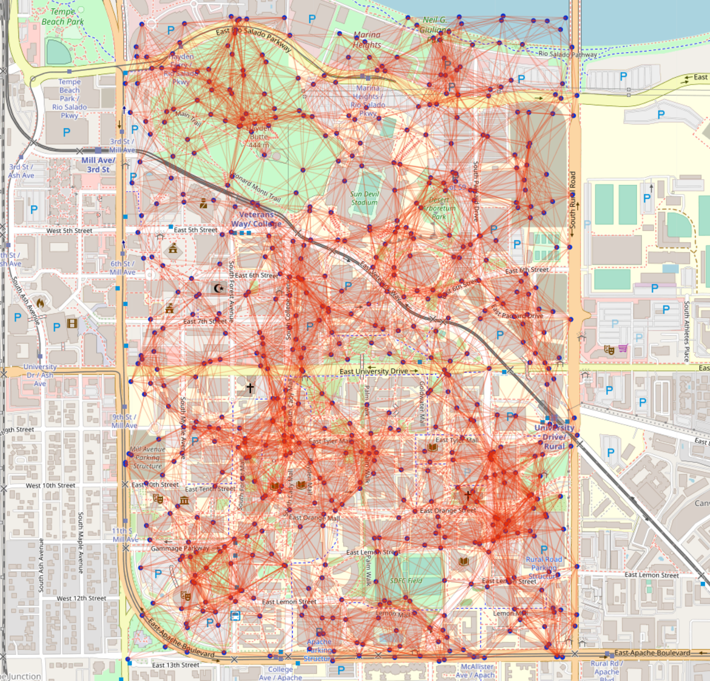

<h3 align="center">Communication Graph Generator</h3>

### About The Project
This project creates sample communication graphs by using generated user's geographical position.

The project contains a jupyter notebook and a python script to generate the output.

Initial user locations can be supplied using a csv (see sample_users.csv) or can be generated within a defined area using Latitude and Longitude. The number of iterations, the movement range, and the communication range for the users can also be defined.

For each iteration the users will move a random amount within the set range. Their new locations will then be used to generate a communication graph between the users.

### Usage

Set all the parameters in the last cell of the jupyter notebook or within the main method of the python script and run.

A single json file containing the user positions and communication graph for each iteration will be generated. The python scrip ReadSample.py is inlcuded to show an example of how to access the information.

Also a folder for each iteration with the user info and graph as csv files will be made.
If the include_plots option is enabled the iteration folders will also include three map plots; One with the locations of the users, one with the user's communication ranges, and one with the communication graph.

Below is an example of the connection graph plot:

### Dataset Citation

### Publications

